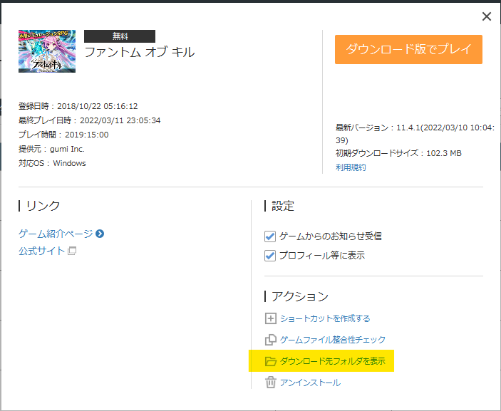

# potk-unit-database

This is a collection of python scripts to:

* Download unit data from PotK live service.
* Parse it locally into useful unit stats.
* Render a simple static html site with those stats.
* Optionally, upload the site to neocities.org, provided you have the password.

## Requisites

* Python 3.8+
* Access to an updated `paths.json` file from the game.

## Quickstart (Windows)

* Find your `paths.json` file.
* Drag And Drop it over [`update_local.bat`](update_local.bat).
* Browse it at [`site/index.html`](site/index.html).

## Quickstart (elsewhere)

* Install the required python packages with [`pip install -r requirements.txt`](requirements.txt).
* Drag&Drop the `paths.json` file into [`0_download_master_data.py`](0_download_master_data.py).
* Drag&Drop the `paths.json` file into [`1_download_site_assets.py`](1_download_site_assets.py).
* Render the site locally with [`3_render_html.py`](3_render_html.py).
* Browse it at [`site/index.html`](site/index.html).

## Uploading

In order to upload your local files to the public [potk-fan-database.neocities.org][1],
you must have a valid token for the neocities account.

[1]: https://potk-fan-database.neocities.org

Place it in a file `~/.config/neocities/config` under your user home directory.

E.g. on Windows, assuming your user is `eumesmo`, the full path would be
`C:\Users\eumesmo\.config\neocities\config`.

Then, just run [`4_update_site.py`](4_update_site.py).

# Locating `paths.json` on the DMM version

On the DMM version, it'll be inside de game folder, under `PoK\Data\paths.json`.

You can open the game folder via the DMM Player itself: 

# Advanced Usage

All numbered script files use the `click` library to provide and CLI interface.
You can view all options supported by each command with the `--help` switch,
e.g.: `python 1_download_site_assets.py --help`.

The most useful recipes are:

* `python 1_download_site_assets.py --no-remote paths.json`: Downloads **all**
  assets, instead of just assets the remote site does not have.
  You probably should run this at least once, so you can browse the site
  locally without broken pictures. *This download will take a while*.
* `python 4_update_site.py --dry-run` which only checks what needs to be
  uploaded without actually uploading anything. Useful for sanity checks before
  a large update.
* `python 3_render_html.py --clean` which removes all local html files before
  rendering them again. Useful if a unit was deleted on the game or something
  went wrong on a previous render run.
